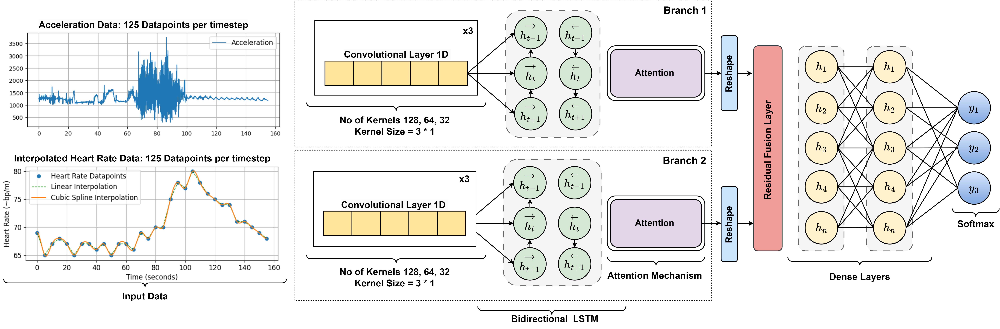

# AMBER MODEL
Author: Dr Jamie Pordoy

Published in: 42nd Annual International Conferences of the IEEE Engineering in Medicine and Biology Society in 
conjunction with the 43rd Annual Conference of the Canadian Medical and Biological Engineering Society (EMBS)
July 20-24, 2020 via the EMBS Virtual Academy

---

## Introduction
AMBER (Attention-guided Multi-Branching-pipeline with Enhanced Residual fusion) is a deep learning architecture designed for multimodal seizure detection tasks. It addresses the challenges of processing heterogeneous data sources by constructing dedicated branches for each feature modality. By leveraging a hybrid neural network structure composed of one-dimensional Convolutional Neural Networks (1D CNNs) and Bidirectional Long Short-Term Memory Networks (BiLSTMs), AMBER effectively captures temporal dependencies and salient features from multiple modalities simultaneously.

---

---


## Network Architecture


Our proposed architecture comprises the following four layers: the manifold reduction layer, the common embedded space, the tangent projection layer, and the federated layer. The function of each layer is detailed below:

1. **Manifold Reduction Layer**: Spatial covariance matrices are consistently presumed to inhabit high-dimensional Symmetric Positive Definite (SPD) manifolds. This layer acts as a linear map from the high-dimensional SPD manifold to the low-dimensional counterpart, with undefined weights reserved for learning.

2. **Common Embedded Space**: The common space is the low-dimensional SPD manifold, whose elements are diminished from each high-dimensional SPD manifold. It is specifically designed for the transfer learning setting.

3. **Tangent Projection Layer**: The function of this layer is to project the matrices on SPD manifolds to its tangent space, which is a local linear approximation of the curved space.

4. **Federated Layer**: Deep neural networks are implemented in this layer. For the transfer learning setting, the parameters of neural networks are updated by federated aggregation.

---


### How To Run The Code

We extend our gratitude to the open-source community, which facilitates the wider dissemination of the work of other researchers as well as our own. The coding style in this repo is relatively rough. We welcome anyone to refactor it to make it more effective. The codebase for our models builds heavily on the following repositories:
[</img>](https://github.com/pyRiemann/pyRiemann) 
[</img>](https://github.com/zhiwu-huang/SPDNet)
[</img>](https://github.com/mne-tools/mne-python)

### Data pre-processing

Please put your training data and labels into a directory "raw_data/" in this project.
The package `mne` is adopted for EEG data pro-processing. To generate the required data as SPDNet input, please refer to the following example code: 

```python        
import pandas as pd
import numpy as np
from data_loader import DataLoader
from data_formatter import DataFormatter
from model import Amber
from kfold_cv import KFoldCrossValidation
from evaluator import evaluate_model_performance
from config import config

# Define your DataFrame and parameter
mypath = 'Data/Train.csv'
df = pd.read_csv(mypath)
target_column = 'label'  # Name of the target column

# Step 1: Load Data
data_loader = DataLoader(dataframe=df, time_steps=config.N_TIME_STEPS, step=config.step, target_column=target_column)
segments, labels = data_loader.load_data()

# Step 2: Format Data
data_formatter = DataFormatter(config=config)
X_train_reshaped, X_test_reshaped, y_train, y_test = data_formatter.format_data(segments, labels)

# Reshape y_test correctly
y_test_reshaped = np.asarray(y_test, dtype=np.float32)

# Initialize model
ts_model = Amber(row_hidden=config.row_hidden, col_hidden=config.row_hidden, num_classes=config.N_CLASSES)

# Create an instance of KFoldCrossValidation
kfold_cv = KFoldCrossValidation(ts_model, [X_train_reshaped['Feature_1'], X_train_reshaped['Feature_2']], y_train)

# Run the cross-validation
kfold_cv.run()

# Evaluate the model performance
evaluation_results = evaluate_model_performance(ts_model, [X_test_reshaped['Feature_1'], X_test_reshaped['Feature_2']], y_test_reshaped)

# Access individual metrics
print("Accuracy:", evaluation_results["accuracy"])
print("F1 Score:", evaluation_results["f1"])
print("Cohen's Kappa:", evaluation_results["cohen_kappa"])

```

### Model training

For subject-adaptive analysis, run `SPDNet_Federated_Transfer_Learning.py `

For subject-specific analysis, run `SPDNet_Local_Learning.py`

---

## Federated Transfer Learning Framework for Biomedical Applications

We have engineered a Federated Transfer Learning (FTL) framework designed for a range of biomedical applications. The FTL framework incorporates various federated learning architectures including FATE and PyTorch, and it caters to biomedical machine learning tasks involving diverse types of data. We posit that the FTL framework offers a user-friendly tool for researchers to explore machine learning tasks pertaining to various biomedical data types, while ensuring privacy protection and superior performance. We intend to open-source the FTL framework in the near future.


---

## Contributions

We implement a federated learning framework to construct BCI models from multiple subjects with heterogeneous distributions. Key advantages of our Federated Transfer Learning (FTL) approach include:

1. **Privacy**: FTL preserves user privacy by retaining the EEG data of each subject on-device, preventing any potential data leaks.
2. **Spatial Covariance Matrix Utilization**: By using the spatial covariance matrix as an input, FTL surpasses other state-of-the-art deep learning methods in EEG-MI tasks, resulting in a 6% increase in accuracy.
3. **Transfer Learning**: FTL leverages transfer learning to attain superior classification accuracy, even for subjects whose EEG signals might be considered 'bad' or challenging to interpret.

The major contribution of this study lies in reporting promising trial results within specific scenarios. However, due to the relatively small number of trials per subject in the test dataset, the classification results exhibit considerable randomness. Under varying datasets, tasks, and division methods, our approach will yield differing performances. Hence, we suggest users to fine-tune parameters and network structures according to their own contexts in order to attain optimal results.

---


## Cite Us

For an in-depth insight into our work, we kindly direct you to our paper presented at the 42nd Annual International Conferences of the IEEE Engineering in Medicine and Biology Society, held in conjunction with the 43rd Annual Conference of the Canadian Medical and Biological Engineering Society (EMBS), which took place between July 20-24, 2020, through the EMBS Virtual Academy:

[Federated Transfer Learning for EEG Signal Classification](https://arxiv.org/abs/2004.12321)

If this project helps you in your research, please cite our work in your paper.

```
@article{ju2020federated,
  title={Federated Transfer Learning for EEG Signal Classification},
  author={Ju, Ce and Gao, Dashan and Mane, Ravikiran and Tan, Ben and Liu, Yang and Guan, Cuntai},
  journal={IEEE Engineering in Medicine and Biology Society (EMBC)},
  year={2020}
}
```
---

## Follow-up Works

The fundamental neural network structure currently utilized for transfer learning is a second-order neural network structure. In our follow-up work, we further developed this network structure, proposing several geometric BCI classifiers. If you are interested in our follow-up work, please proceed to the following URL:https://github.com/GeometricBCI/Tensor-CSPNet-and-Graph-CSPNet These geometric BCI classifiers, inspired by differential geometry, have achieved state-of-the-art results in subject-specific scenarios across multiple motor imagery datasets.

---

## Authors

This research was undertaken by a collaborative team from the Hong Kong University of Science and Technology, the Southern University of Science and Technology, WeBank Co. Ltd., and Nanyang Technological University.


The authors are


